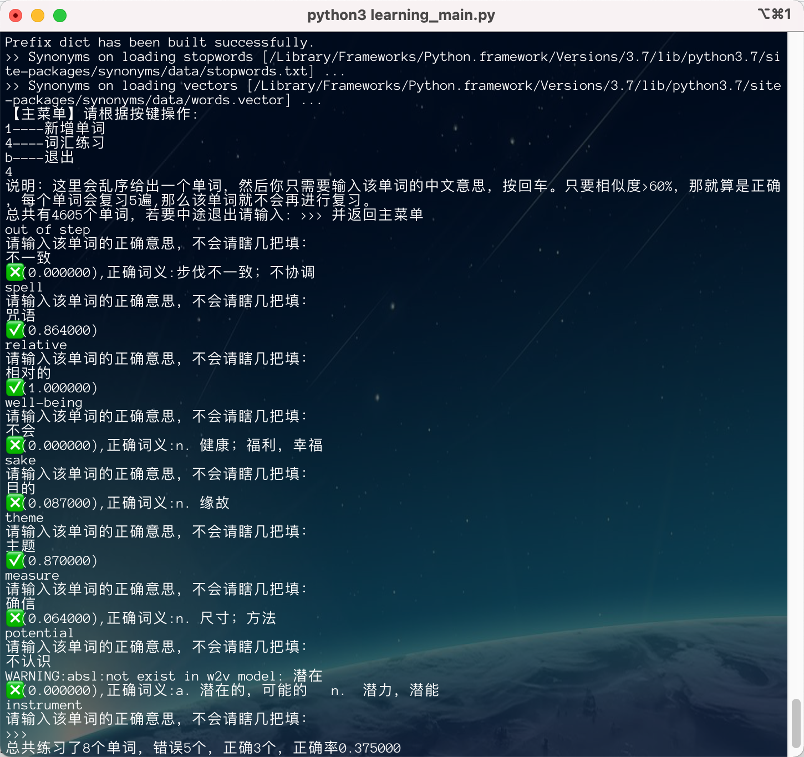

# 介绍

为了让上班党能更好的利用**摸鱼**时间复习英语单词，进而搞出来的一个命令行的背单词的复习工具。

复习流程:根据给出的单词输入该单词的词义，进行比对，与正确的词义对比，相似度>60%,则正确。每正确一次，该单词的 有效复习次数+1。正确5次后该单词不会再进行复习。



# 安装与使用

前置要求

- Python 3.X环境
- Mysql 5.7 + 

使用:

- 1.克隆代码

```shell
git clone https://github.com/AZiMiao1122/mo_fish_review.git
```


- 2.安装依赖

```shell
pip3 install requirements.txt
```


- 3.复制数据库/导入单词数据/手动一条条插入

此处包含一个00015自学英语二的单词，创建一个数据库，然后导入即可。其他的单词请自行想办法导入。

- 4.更改数据库配置

  在package/sql_conf.py里修改数据库配置。

- 5.运行开始复习

```shell
python3 learning_main.py
```


### 感觉还不错请给个star，祝你考试合格。

